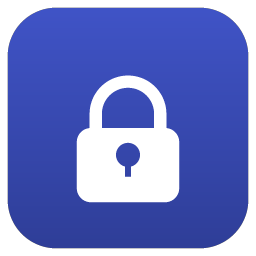
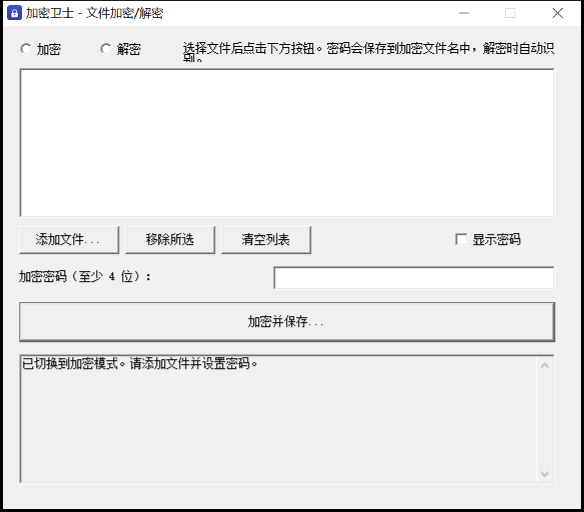
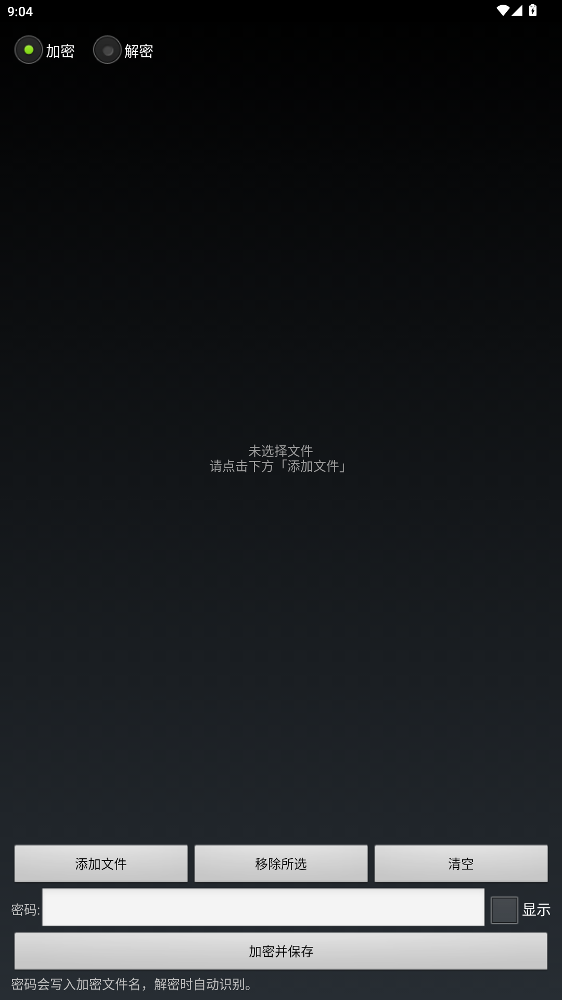

# 加密卫士

简单易用的本地文件加解密工具，支持 **Windows / Android / 网页** 三端，密文格式完全互通。



## 特点

- **任意文件加密**：图片、视频、音频、文档……都能加密为 `.enc` 密文
- **密码写进文件名**：加密结果形如 `照片.jpg__pwd_abc123.enc`，解密时自动识别，无需记忆
- **随机密码**：一键生成 14 位强密码，省心
- **多文件自动打包**：一次多选，自动打包成一个密文；解密先列出结果，可勾选逐个保存原文件，或一键打包 ZIP
- **解密后可直接预览**：图片、文本三端均可（无法识别的按 HEX 预览）；音频 / 视频在手机版内置播放（进度条、播放暂停、正计时 / 倒计时），Windows 版用系统默认播放器打开
- **完全离线**：所有数据仅在本机处理，不联网、不上传
- **三端互通**：Windows、Android、网页加密的文件，三端都能解
- **加密强度**：AES-256-GCM + PBKDF2 密钥拉伸（60 万次迭代）

## 下载

前往 [Releases](https://github.com/knvbepr/crypto-guard/releases/latest) 下载：

| 平台 | 发布文件 | 大小 | 要求 |
| --- | --- | --- | --- |
| Windows | `CryptoGuard-windows.exe` | 约 78 KB | Windows 7 及以上，免安装单文件，支持高清 DPI |
| Android | `CryptoGuard-android.apk` | 约 41 KB | Android 5.0 及以上 |
| 网页版 | `CryptoGuard-web.html` | 约 59 KB | Chrome / Edge / Safari，双击即用 |

> 下载后文件可随意重命名，不影响使用。

## 使用方法

三步加密：**添加文件 → 设置密码 → 加密并保存**；解密时密码自动从文件名读出。

详见 [使用说明.txt](使用说明.txt)，版本记录见 [更新日志.txt](更新日志.txt)。

## 截图

| Windows 版 | Android 版 |
| --- | --- |
|  |  |

## 从源码构建

需要安装 [Node.js](https://nodejs.org/)（用于生成图标）。

```powershell
# 1. 下载编译工具到 _tools（TinyCC + JDK + Android build-tools，自动测速选最快镜像）
powershell -ExecutionPolicy Bypass -File .\get-tools.ps1

# 2. 构建 Windows 版 → 输出 加密卫士.exe
powershell -ExecutionPolicy Bypass -File .\win32\build.ps1

# 3. 构建 Android 版 → 输出 加密卫士.apk
powershell -ExecutionPolicy Bypass -File .\android\build.ps1
```

网页版无需构建：直接打开 `加密卫士网页版.html`。

## 目录结构

```
├── 加密卫士网页版.html   网页版（单文件应用，零依赖）
├── 使用说明.txt          用户手册
├── 更新日志.txt          版本记录
├── 开发记录.txt          开发过程与设计说明
├── get-tools.ps1         下载编译工具
├── win32/                Windows 版源码
│   ├── guard.c           主程序（Win32 API + 系统 bcrypt 加密 + 界面 + 测试命令行）
│   ├── seticon.c         图标注入工具
│   └── build.ps1         一键构建（TinyCC 编译，输出单文件 exe）
├── android/              Android 版源码
│   ├── src/              纯 Java 实现（无第三方依赖，minSdk 21）
│   ├── test/             桌面端互通测试
│   ├── AndroidManifest.xml
│   └── build.ps1         一键构建（javac + d8 + aapt2 + apksigner）
└── assets/               图标生成脚本、截图
```

## 兼容与互操作性

- 三端密文格式一致（自研 ENC 容器 + MPKG 打包格式），可互相解密
- 网页版在浏览器缺少 WebCrypto 时（如 Safari 打开本地文件）自动切换内置纯 JS 加密，结果一致
- 文件名中的密码是明文：如需分享又不想暴露密码，把文件名里 `__pwd_...` 段删除即可，解密时手动输入密码
- 已通过测试：Windows↔网页 16 项、Android↔网页 19 项、Safari 兜底加密 25 项，全部通过


本仓库内容来自大肥鱼老师，如有谬误请在ISSUE指出（你问我为什么不弄，因为我还不会，长大后再学习 qwq）